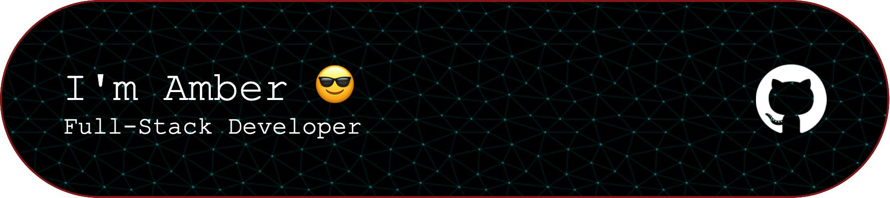

<div align="center"></div>

<div align="center">

</div>  
  

### <div align="center">Hi! I'm Amber. A full-time full-stack freelance developer 👨‍💻 working remotely 🚀</div>  
  

- 🔭 Most of my projects are on [KrustyKrab.us](www.krustykrab.us)  
  

- 🌱 I’m currently learning MongoDB  
  

- ❓ Ask me anything about JavaScript
  

- ⚡ Fun fact: I just finished my first 10K Tough Mudder  
  

<br/>  


## My Skill Set  
<table><tr><td valign="top" width="50%">


### Frontend  
<div align="center">  
  
  
  
  
  
  
  
  
  
</div>

</td><td valign="top" width="50%">


### Backend  
<div align="center">  
  
  
  
  
  
  
  
  
  
</div>


</td></tr></table>  

<br/>  

## Github Stats  

<table><tr><td valign="center" width="500px" border-radius="0px">


<div align="center"></div>
  
  </td><td valign="center" width="500px" border="none">

<div align="center"></div>

  </td></tr></table> 
<br/>  

### A little more about me...


```javascript
const knowledge = {
  code: [Javascript, Java, Python, Typescript, HTML, CSS, Sass],
  tools: [React, Node, Django, Styled-Components, Jest, MongoDB, Express, Heroku, Postman]
}
```

<br/>
<div align="center">

</div>
<br/>

---
<br/>
<div align="center">Part of this profile was generated using <a href="https://profilinator.rishav.dev/" target="_blank">Github Profilinator</a></div>
